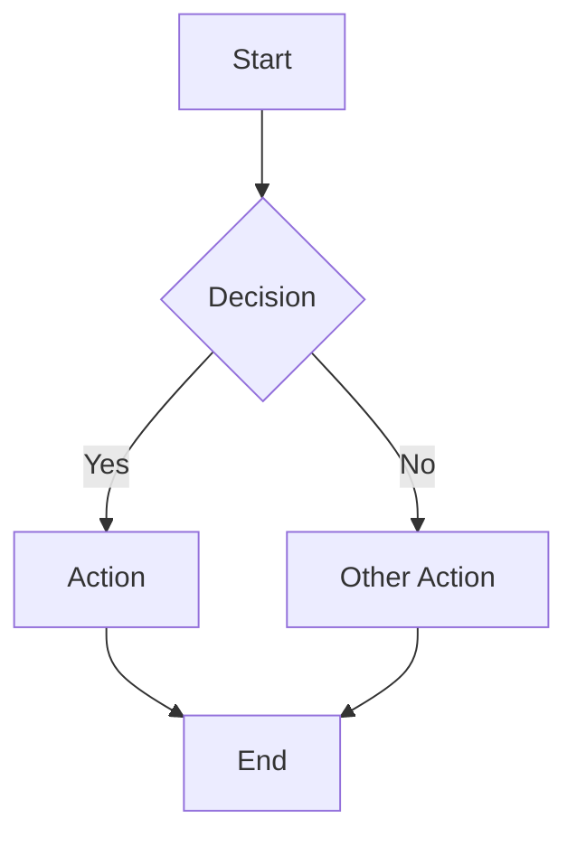
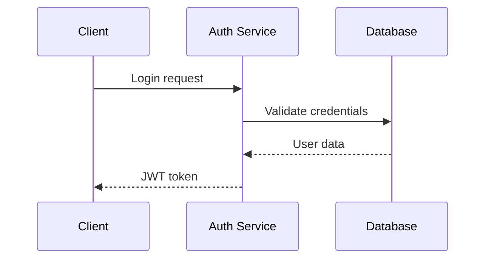
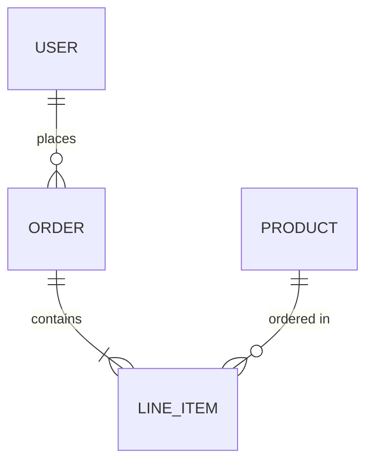
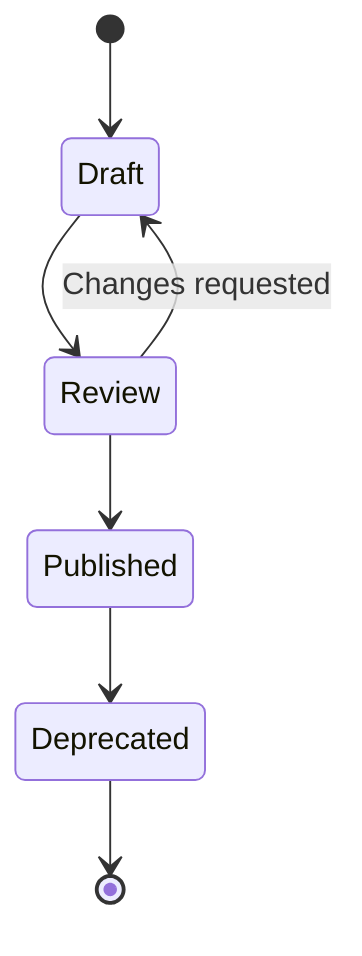
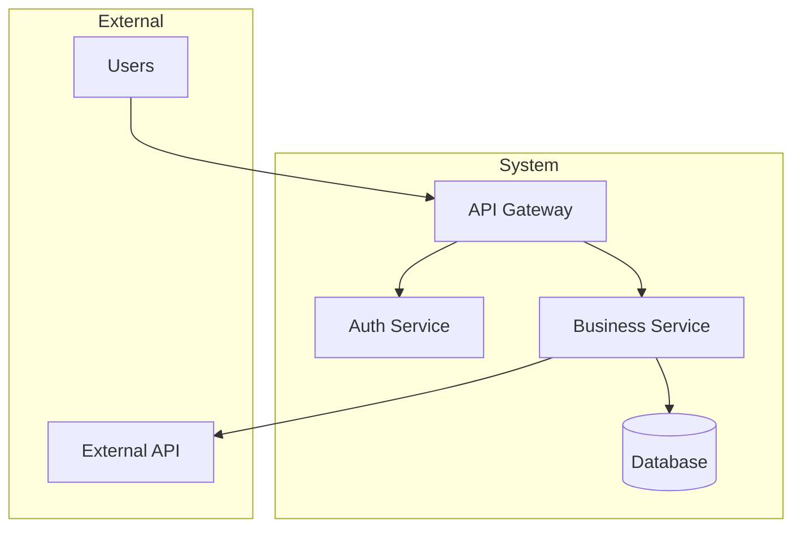

# Obsidian Markdown Skill

Create markdown for Obsidian vaults that renders cleanly in both Obsidian and GitHub. Prioritize portability, structured metadata, and documentation that lives alongside code.

## Portability Principles

**GitHub renders:** Standard markdown, GFM tables, Mermaid, code blocks, frontmatter (hidden), relative links, images.

**Obsidian-only:** Wiki links `[[note]]`, callouts `> [!note]`, embeds `![[file]]`, block references `^id`, Dataview, Bases.

**Strategy:** Use GFM-compatible syntax as the foundation. Add Obsidian features only when they provide significant value and acceptable degradation on GitHub.

## Frontmatter (Properties)

Every documentation note should have frontmatter. GitHub hides it; Obsidian indexes it for queries.

### Minimal Doc Frontmatter

```yaml
---
title: "Component Name"
tags:
  - docs
  - api
created: 2025-01-15
---
```

### Full Project Doc Frontmatter

```yaml
---
title: "Authentication Service"
aliases:
  - auth
  - auth-service
tags:
  - docs
  - service
  - security
status: active
owner: "[[People/jane-doe]]"
related:
  - "[[Services/user-service]]"
  - "[[Specs/auth-spec]]"
created: 2025-01-15
updated: 2025-01-20
---
```

### Property Types

| Type | Format | Use Case |
|------|--------|----------|
| Text | `key: "value"` | Titles, descriptions |
| List | `tags: [a, b, c]` | Tags, related docs |
| Date | `created: 2025-01-15` | Timestamps |
| Boolean | `published: true` | Flags |
| Link | `owner: "[[Person]]"` | Relationships (quote wiki links) |

### Standard Properties for Docs

```yaml
title:      # Display name
aliases:    # Alternative names for linking
tags:       # Categorization
status:     # draft | active | deprecated | archived
owner:      # Responsible person/team
related:    # Related documents
created:    # Creation date
updated:    # Last meaningful update
```

## Tagging Strategy

Tags categorize; links relate. Use tags for filtering/querying, links for relationships.

### Tag Hierarchy

```yaml
tags:
  - docs                    # Top-level type
  - docs/api                # Nested for specificity
  - docs/api/rest
```

### Recommended Tag Taxonomy

```
docs/           → Documentation type
  api
  guide  
  spec
  adr             → Architecture Decision Records
  runbook

component/      → System components
  service
  library
  config

status/         → Lifecycle state (alternative to status property)
  draft
  review
  stable
  deprecated
```

### Tag vs Property for Status

**Property approach** (recommended for queryability):
```yaml
status: active
```

**Tag approach** (visible in GitHub):
```yaml
tags:
  - status/active
```

Pick one convention and stick with it.

## Linking Patterns

### Relative Links (GitHub-Compatible)

```markdown
See the [API documentation](./api/README.md)
Check the [auth spec](../specs/auth-spec.md)
```

✅ Works in GitHub, Obsidian, and most markdown renderers.

### Wiki Links (Obsidian-Enhanced)

```markdown
[[API Documentation]]
[[Auth Spec|authentication spec]]
[[Services/Auth Service#Configuration]]
```

⚠️ Obsidian-only. GitHub shows raw `[[text]]`.

### When to Use Each

| Context | Use | Reason |
|---------|-----|--------|
| README, root docs | Relative links | GitHub landing pages |
| Internal notes | Wiki links | Speed, auto-complete, refactor-safe |
| Cross-repo links | Relative/URLs | Must work outside vault |
| People, concepts | Wiki links | Relationship mapping |

### Hybrid Approach

For critical docs that must work everywhere:

```markdown
See the [Authentication Service](./services/auth-service.md) for details.
```

For internal knowledge that can degrade gracefully:

```markdown
Owned by [[People/Jane Doe]]. Related: [[Specs/Auth Spec]].
```

## Document Structure

### Standard Doc Template

```markdown
---
title: "Service Name"
tags: [docs, service]
status: active
created: 2025-01-15
---

# Service Name

Brief description (1-2 sentences).

## Overview

What this service does and why it exists.

## Architecture

` ``mermaid
graph LR
    A[Client] --> B[API Gateway]
    B --> C[This Service]
    C --> D[(Database)]
` ``

## Configuration

| Variable | Description | Default |
|----------|-------------|---------|
| `PORT` | Server port | `3000` |
| `DB_URL` | Database connection | required |

## API

### `GET /resource`

Description of endpoint.

## Related

- [Upstream Service](./upstream.md)
- [API Spec](../specs/api-spec.md)
```

### Maps of Content (MOCs)

Index notes that organize related content:

```markdown
---
title: "Services"
tags: [moc, docs]
---

# Services

## Core Services

- [[Auth Service]] - Authentication and authorization
- [[User Service]] - User management
- [[API Gateway]] - Request routing

## Supporting Services

- [[Logging Service]]
- [[Metrics Service]]

## By Status

### Active
` ``dataview
LIST
FROM #service AND -#moc
WHERE status = "active"
` ``

### Deprecated
` ``dataview
LIST  
FROM #service
WHERE status = "deprecated"
` ``
```

MOCs provide navigation GitHub can render (the static links) with Obsidian enhancements (Dataview queries).

## Mermaid Diagrams

Mermaid renders in both GitHub and Obsidian. Prefer over Canvas or images.

### Flowchart



### Sequence Diagram



### Entity Relationship



### State Diagram



### Architecture (C4-Style)



## Callouts

Obsidian-only but degrade gracefully (GitHub shows as blockquotes).

```markdown
> [!warning] Breaking Change
> The v2 API removes the `legacy_field` parameter.

> [!tip] Performance
> Enable caching for 10x throughput improvement.

> [!note]
> This section is under active development.
```

**GitHub renders as:**
> **warning** Breaking Change
> The v2 API removes the `legacy_field` parameter.

Acceptable degradation for internal docs.

## Code Blocks

Standard fenced blocks with language hints:

```typescript
interface User {
  id: string;
  email: string;
  role: 'admin' | 'user';
}
```

```bash
# Deploy command
./deploy.sh --env production
```

```sql
SELECT * FROM users WHERE active = true;
```

## Tables

GFM tables work everywhere:

```markdown
| Method | Endpoint | Description |
|--------|----------|-------------|
| GET | `/users` | List users |
| POST | `/users` | Create user |
| GET | `/users/:id` | Get user |
```

Align columns:
```markdown
| Left | Center | Right |
|:-----|:------:|------:|
| a    |   b    |     c |
```

## What to Avoid

❌ **Canvas files** - Not portable, binary-ish JSON, no GitHub render. Use Mermaid.

❌ **Excessive wiki links in READMEs** - GitHub shows ugly `[[raw text]]`.

❌ **Dataview in user-facing docs** - Requires plugin, no GitHub render.

❌ **Block references** - `^block-id` syntax has no graceful degradation.

❌ **Deeply nested tags** - `#docs/api/rest/v2/auth` is unmaintainable. Max 2-3 levels.

❌ **Embeds in portable docs** - `![[note]]` shows raw text on GitHub.

## Vault Structure for Repos

```
docs/
├── README.md              # Entry point (pure GFM)
├── ARCHITECTURE.md        # System overview
├── index.md               # MOC for Obsidian
├── services/
│   ├── auth-service.md
│   └── user-service.md
├── specs/
│   ├── api-spec.md
│   └── data-model.md
├── adrs/                  # Architecture Decision Records
│   ├── 001-use-postgres.md
│   └── 002-jwt-auth.md
├── runbooks/
│   └── deploy.md
└── assets/
    └── images/            # Only for non-Mermaid images
```

## Quick Reference

### Frontmatter Starter

```yaml
---
title: ""
tags: []
status: draft
created: YYYY-MM-DD
---
```

### GFM-Safe Syntax

| Element | Syntax |
|---------|--------|
| Bold | `**text**` |
| Italic | `*text*` |
| Code | `` `code` `` |
| Link | `[text](url)` |
| Image | `` |
| Heading | `#` through `######` |
| List | `- item` or `1. item` |
| Task | `- [ ] task` |
| Table | `\| a \| b \|` |
| Quote | `> text` |
| HR | `---` |
| Code block | ` ``` lang ` |
| Mermaid | ` ```mermaid ` |

### Obsidian Extras (Use Sparingly)

| Element | Syntax | GitHub Shows |
|---------|--------|--------------|
| Wiki link | `[[Note]]` | `[[Note]]` raw |
| Embed | `![[Note]]` | `![[Note]]` raw |
| Callout | `> [!type]` | Plain blockquote |
| Tag | `#tag` | `#tag` as text |
| Highlight | `==text==` | `==text==` raw |
| Comment | `%%hidden%%` | `%%hidden%%` raw |

See `references/dataview.md` for query syntax (internal use only).
See `references/bases.md` for Bases syntax (internal use only).
